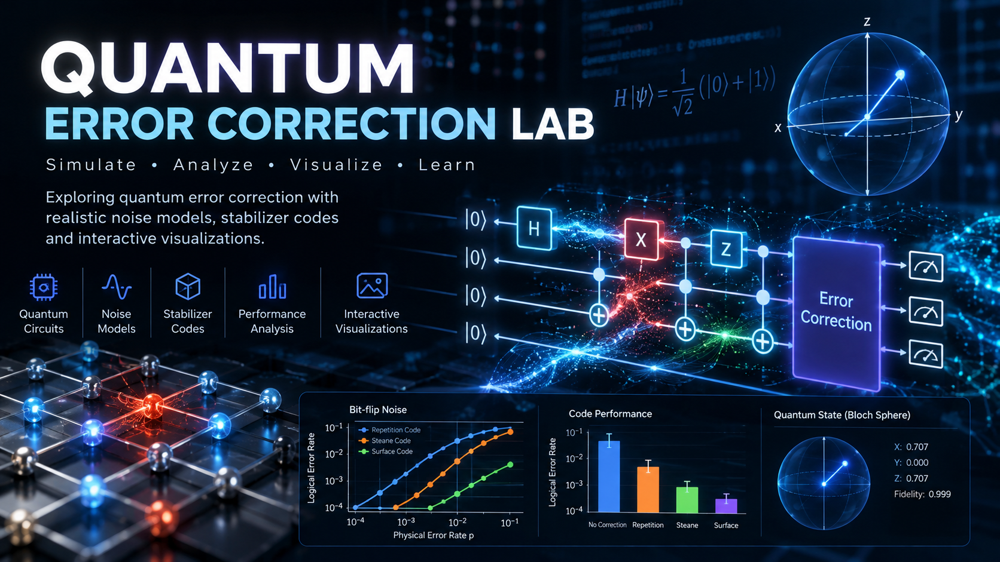
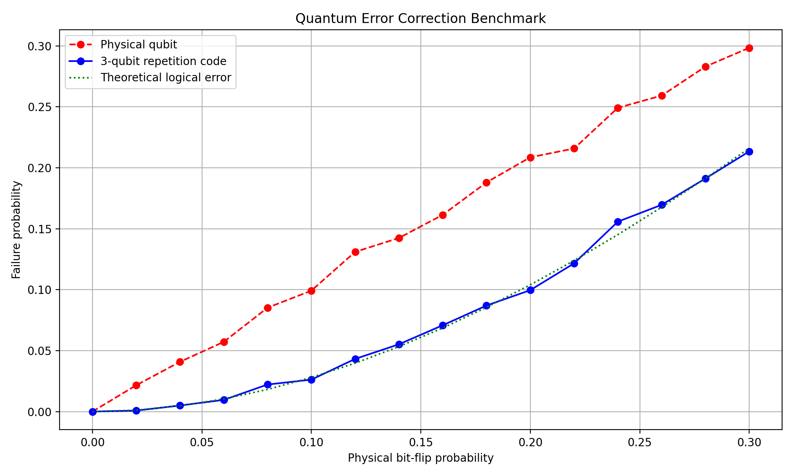
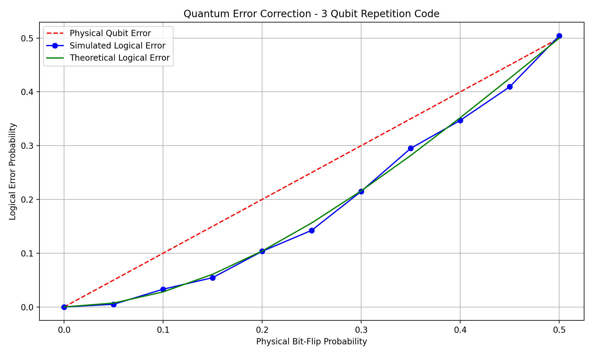

# Quantum Error Correction Lab

A Python and Qiskit research project exploring quantum error correction, noise simulation, and logical error reduction using the three-qubit repetition code.

## Overview

Quantum computers are vulnerable to noise and decoherence. Quantum error correction helps protect encoded quantum information against selected physical errors.

This project demonstrates:

- Three-qubit bit-flip repetition code
- Syndrome extraction using ancilla qubits
- Conditional quantum error correction
- Qiskit Aer simulations
- Depolarizing gate noise and readout noise
- Physical vs. logical error benchmarking
- Visualization and CSV export

## Technology Stack

- Python
- Qiskit
- Qiskit Aer
- NumPy
- Matplotlib
- unittest

## Project Structure

```text
quantum-error-correction-lab/
├── main.py
├── quantum_circuit.py
├── noise_simulation.py
├── advanced_noise.py
├── benchmark.py
├── tests/
│   └── test_main.py
├── quantum_error_correction_results.png
├── quantum_benchmark.png
├── benchmark_results.csv
└── README.md
```

## Installation

Install the dependencies:

```bash
python -m pip install qiskit qiskit-aer numpy matplotlib
```

## Run the Project

Basic repetition-code model:

```bash
python main.py --p 0.1
```

Ideal quantum error correction:

```bash
python quantum_circuit.py
```

Independent bit-flip noise simulation:

```bash
python noise_simulation.py
```

Gate and measurement noise:

```bash
python advanced_noise.py
```

Physical vs. logical error benchmark:

```bash
python benchmark.py
```

## Run Tests

```bash
python -m unittest discover -s tests -p "test_main.py" -v
```

## Theoretical Model

For independent bit-flip errors with probability p on each of the three physical qubits, ideal majority-vote decoding produces the logical failure probability:

P(logical error) = 3p² - 2p³

For p = 0.10:

- Physical error probability: 10%
- Ideal logical error probability: 2.8%

## Results

### Bit-Flip Error Benchmark



### Noise Simulation



The benchmark compares a single physical qubit with an ideal three-qubit repetition code under independent bit-flip noise.

The advanced noise simulation separately studies the effects of noisy gates and imperfect measurements.

## Limitations

- The three-qubit repetition code corrects a single X error but does not protect against arbitrary quantum errors.
- The ideal benchmark assumes perfect encoding and decoding.
- The advanced simulation includes noisy gates and readout, but does not establish a fault-tolerance threshold.
- The experiments use simulators rather than physical quantum hardware.
- Full logical-state fidelity and fault-tolerant quantum error correction remain future work.

## Future Development

- Repeated syndrome measurements
- Logical error benchmarking under circuit-level noise
- Five-qubit quantum error correction
- Quantum hardware experiments
- Automated continuous integration

## Research Portfolio

AI & Quantum Research Lab

https://quantum-ai-showcase.vercel.app
